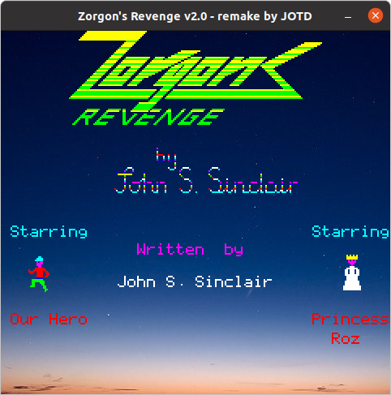
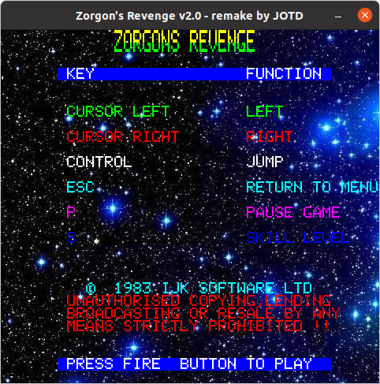

# Zorgon's Revenge

### Description
From https://jotd.pagesperso-orange.fr/zorgon/index.html
Zorgon's Revenge remake (C) 2008-2014 JOTD

Original code (C) 1983 by John S. Sinclair, IJK Software,

This is the developer package with full source + tools
You need to unpack it where the user package is to get all data files & DLLs

### Pre-require
To compile Zorgon's Revenge you need the following

- SDL 1.2 distribution: https://www.libsdl.org/download-1.2.php
- A gcc compiler
- GPRBuild: http://libre.adacore.com/download/configurations (get GNAT GPL 2014: gcc & gprbuild are included)

Set SDL_HOME environment variable where SDL+SDL_Image is installed

If you want to open the .gpr project, you'll need Gnat Programming Studio available here: http://libre.adacore.com/tools/gps/

### Build it!
'''
./build_zr.sh
'''
let's go!

### How to play
CTRL	"Jump Key"
CTRL	"Fire key"

